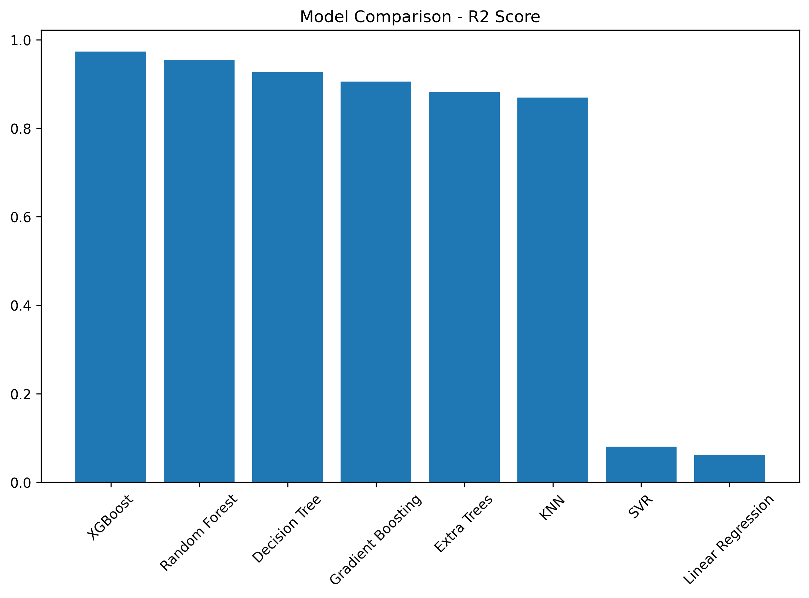
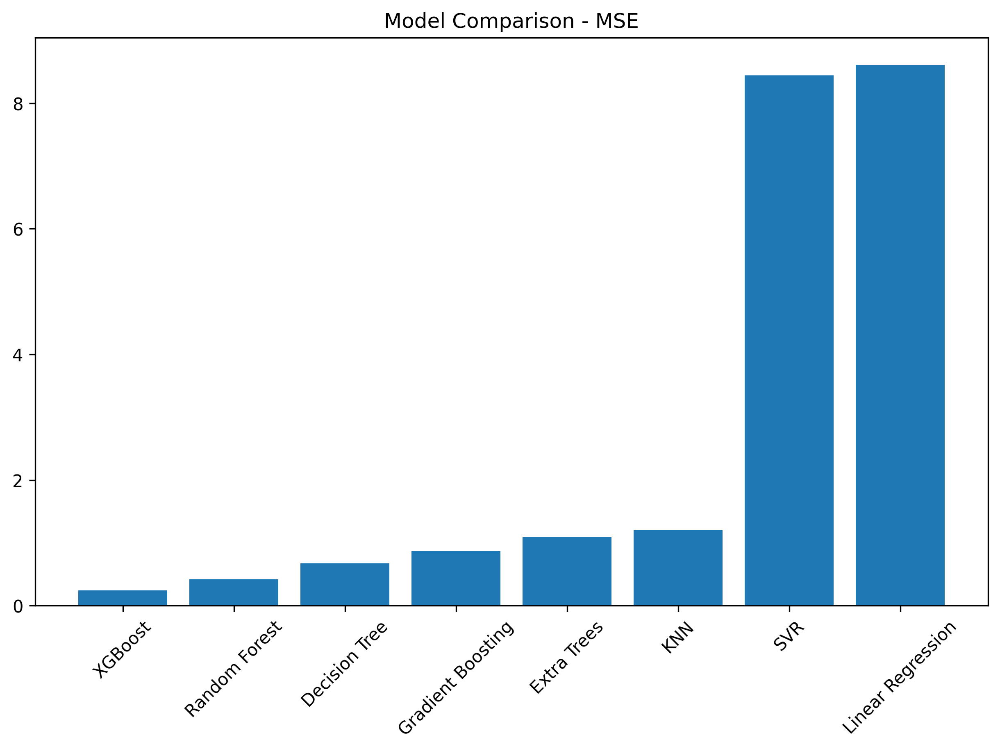
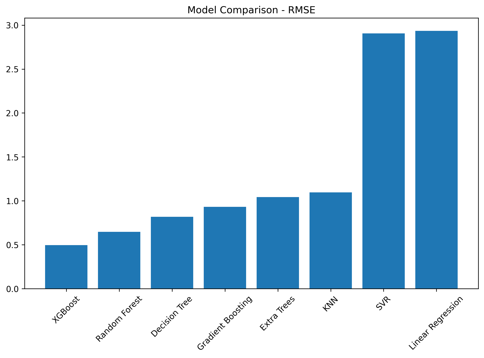
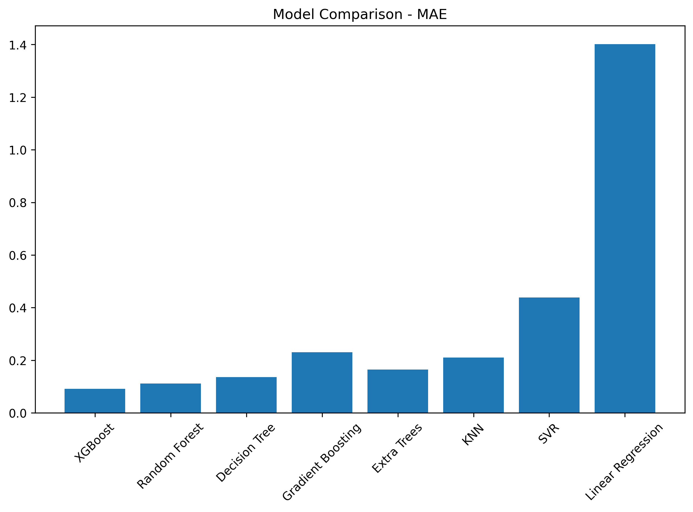

# 🏥 Data Generation using Modelling & Simulation for Machine Learning

> **Assignment 2 — UCS654: Predictive Analytics using Statistics and Machine Learning**
> **Student Roll Number:** 102316004

---

## 📋 Table of Contents

- [Overview](#overview)
- [Simulation Tool — SimPy](#simulation-tool--simpy)
- [Simulation Parameters](#simulation-parameters)
- [Methodology](#methodology)
- [Dataset](#dataset)
- [Machine Learning Models](#machine-learning-models)
- [Results & Model Comparison](#results--model-comparison)
- [Visualizations](#visualizations)
- [Best Model](#best-model)
- [Tech Stack](#tech-stack)
- [How to Run](#how-to-run)

---

## 🔍 Overview

This assignment demonstrates **data generation through simulation** and **machine learning model evaluation** on the generated dataset. A **discrete-event simulation** of a hospital/clinic queueing system (M/M/c queue) was built using [SimPy](https://simpy.readthedocs.io/en/latest/), a Python-based process-oriented simulation library.

1000 simulation runs were performed with randomly varied parameters, and the results were used to train and benchmark **8 different regression models** to predict the **average patient waiting time**.

---

## 🛠️ Simulation Tool — SimPy

**SimPy** is a process-based discrete-event simulation framework built with standard Python. It models active components (patients, servers) as simple Python generator functions—known as *processes*—that `yield` events to pause their execution and wait for them to be triggered.

### Why SimPy?
- Lightweight, Python-native, easy to integrate with NumPy/Pandas
- Ideal for modelling **queueing systems**, supply chains, or any time-driven processes
- Well-documented with a strong community

### Installation
```bash
pip install simpy
```

---

## ⚙️ Simulation Parameters

The simulation models a **multi-server queue** (M/M/c model) at a hospital/clinic.

| Parameter | Description | Lower Bound | Upper Bound |
|---|---|---|---|
| `arrival_rate` | Rate at which patients arrive (patients/unit time) | 2 | 10 |
| `service_rate` | Rate at which each server processes a patient | 5 | 15 |
| `num_servers` | Number of parallel servers (doctors/counters) | 1 | 5 |

> **Seed:** `np.random.seed(102316004)` — ensures reproducibility tied to the roll number.

For each simulation run, the three parameters are sampled **uniformly at random** within their bounds. The simulation runs for `sim_time = 200` time units and records the **average waiting time** across all patients.

---

## 📐 Methodology

```
Step 1 → Select Simulation Tool (SimPy — M/M/c Queue)
Step 2 → Install & Explore SimPy
Step 3 → Identify Parameters & Bounds
           - arrival_rate ∈ [2, 10]
           - service_rate ∈ [5, 15]
           - num_servers  ∈ [1, 5]
Step 4 → Generate random parameter sets & run simulation
Step 5 → Repeat for 1000 simulations → collect dataset
Step 6 → Train 8 ML models & compare on evaluation metrics
```

### Simulation Logic

Each simulation creates a **SimPy environment** with:
- A `Resource` representing the server pool (capacity = `num_servers`)
- Patients arriving via an **exponential inter-arrival distribution** (`1/arrival_rate`)
- Each patient's **service time** drawn from an exponential distribution (`1/service_rate`)
- The average **waiting time** (queue wait before being served) is recorded

---

## 📊 Dataset

The generated dataset (`simulation_data_102316004.csv`) has **1000 rows** and **4 columns**:

| Column | Description |
|---|---|
| `arrival_rate` | Randomly sampled arrival rate |
| `service_rate` | Randomly sampled service rate |
| `servers` | Randomly sampled number of servers |
| `avg_waiting_time` | **Target** — mean patient waiting time from simulation |

**Dataset Statistics:**

| Feature | Min | Max | Std |
|---|---|---|---|
| `arrival_rate` | 2.00 | 10.00 | 2.34 |
| `service_rate` | 5.00 | 14.98 | 2.91 |
| `servers` | 1 | 5 | 1.00 |
| `avg_waiting_time` | 0.00 | 38.54 | 3.93 |

**Train/Test Split:** 80% training / 20% test (`random_state=102316004`)

---

## 🤖 Machine Learning Models

Eight regression models were trained to predict `avg_waiting_time` from the three simulation parameters:

| # | Model |
|---|---|
| 1 | Linear Regression |
| 2 | Decision Tree Regressor |
| 3 | Random Forest Regressor |
| 4 | Gradient Boosting Regressor |
| 5 | Extra Trees Regressor |
| 6 | Support Vector Regressor (SVR) |
| 7 | K-Nearest Neighbours Regressor (KNN) |
| 8 | XGBoost Regressor |

---

## 📈 Results & Model Comparison

All models were evaluated on **four metrics** — higher R² and lower error metrics indicate better performance.

| Model | R² Score ↑ | MSE ↓ | RMSE ↓ | MAE ↓ |
|---|---|---|---|---|
| **XGBoost** ⭐ | **0.9732** | **0.2457** | **0.4957** | **0.0919** |
| Random Forest | 0.9543 | 0.4194 | 0.6476 | 0.1120 |
| Decision Tree | 0.9270 | 0.6698 | 0.8184 | 0.1357 |
| Gradient Boosting | 0.9052 | 0.8702 | 0.9328 | 0.2305 |
| Extra Trees | 0.8815 | 1.0876 | 1.0429 | 0.1647 |
| KNN | 0.8692 | 1.2010 | 1.0959 | 0.2105 |
| SVR | 0.0805 | 8.4405 | 2.9052 | 0.4387 |
| Linear Regression | 0.0619 | 8.6103 | 2.9343 | 1.4013 |

---

## 📉 Visualizations

### R² Score Comparison


---

### MSE Comparison


---

### RMSE Comparison


---

### MAE Comparison


---

## 🏆 Best Model

### ✅ XGBoost Regressor

> **XGBoost** achieved the best performance across **all four evaluation metrics**, making it the clear winner for predicting average patient waiting time in this simulation-based dataset.

| Metric | Score |
|---|---|
| R² Score | **0.9732** |
| MSE | **0.2457** |
| RMSE | **0.4957** |
| MAE | **0.0919** |

**Why XGBoost?** The simulated waiting time has a **non-linear & non-additive** relationship with the input parameters — particularly when `arrival_rate ≈ service_rate` or `num_servers = 1`, causing exponential blow-up in queue length. Tree-based ensembles like XGBoost excel at capturing these complex, threshold-like boundaries that linear models entirely fail to learn (R² ≈ 0.06 for Linear Regression).

---

## 🧰 Tech Stack

| Library | Purpose |
|---|---|
| `simpy` | Discrete-event simulation |
| `numpy` | Numerical computing & random sampling |
| `pandas` | Data manipulation & CSV export |
| `matplotlib` | Visualization / bar plots |
| `scikit-learn` | ML models, train-test split, metrics |
| `xgboost` | XGBoost Regressor |

---

## 🚀 How to Run

1. **Clone the repository** and open in Google Colab or Jupyter Notebook.
2. **Install dependencies:**
   ```bash
   pip install simpy xgboost
   ```
3. **Run all cells** in `ASS2.ipynb` sequentially.
4. The notebook will:
   - Run 1000 hospital queue simulations
   - Export `simulation_data_102316004.csv`
   - Train 8 ML models and export `model_comparison_102316004.csv`
   - Generate and save 4 evaluation plots to the `images/` folder

---

## 📁 File Structure

```
Assignment_2/
├── ASS2.ipynb                        # Main Jupyter Notebook
├── README.md                         # This file
├── images/
│   ├── r2_plot_102316004.png         # R² comparison bar chart
│   ├── mse_plot_102316004.png        # MSE comparison bar chart
│   ├── rmse_plot_102316004.png       # RMSE comparison bar chart
│   ├── mae_plot_102316004.png        # MAE comparison bar chart
│   ├── simulation_data_102316004.csv # Generated simulation dataset
│   └── model_comparison_102316004.csv# Model evaluation results
```

---

<div align="center">

Made with ❤️ | UCS654 — Predictive Analytics | Roll No. 102316004

</div>
