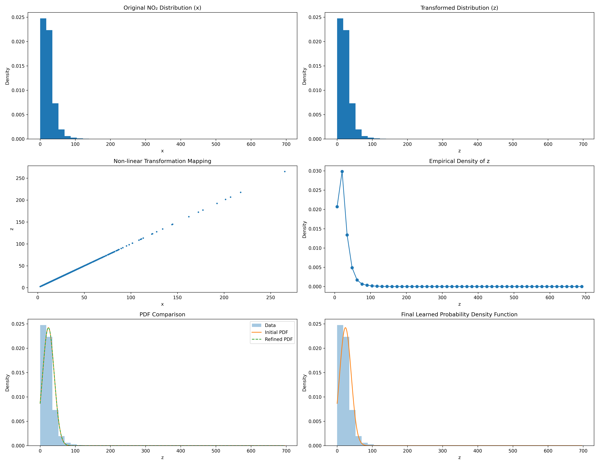

# Assignment 2: Probability Density Function Learning

**Student Roll Number:** 102316004

## Project Overview
This project involves statistical analysis and modeling of environmental data (NO2 levels). The core objective is to learn the Probability Density Function (PDF) of a transformed feature using a parametric model.

## Methodology

### 1. Data Cleaning and Preprocessing
The dataset is loaded and cleaned by removing missing values from the `no2` feature to ensure statistical validity.

### 2. Non-Linear Transformation
We apply a unique, roll-number-dependent non-linear transformation to the feature $x$ to obtain a new variable $z$. The transformation function is defined as:

$$ z = T_r(x) = x + a_r \sin(b_r x) $$

For Roll Number **102316004**:
*   **$a_r$ calculation**: Derived from $r \mod 7$, resulting in $a_r = 0$.
*   **$b_r$ calculation**: Derived from $r \mod 5$, resulting in $b_r = 1.5$.

### 3. PDF Parameter Estimation
We model the probability density function of the transformed variable $z$ using the form:

$$ \hat{p}(z) = c \cdot e^{-\lambda(z-\mu)^2} $$

This is recognized as a Gaussian distribution structure. The parameters are estimated using the **Method of Moments**:
*   $\mu$ (Mean): Estimated directly from the sample mean of $z$.
*   $\lambda$ (Precision parameter): Derived from the sample variance, where $\lambda = \frac{1}{2\sigma^2}$.
*   $c$ (Normalization constant): Derived to ensure the integral of the PDF is 1, where $c = \sqrt{\frac{\lambda}{\pi}}$.

## Visualizations Used
The notebook employs several visualization techniques to analyze the data and validate the model:

1.  ** comparative Histograms**: Side-by-side histograms displaying the distribution of the original feature $x$ versus the transformed feature $z$ to observe the effect of the non-linear transformation.
2.  **Transformation Mapping (Scatter Plot)**: A scatter plot of $x$ vs. $z$ to visualize the specific nature of the mapping function $T_r(x)$.
3.  **Empirical Density Plot**: A scatter plot of the histogram bin centers against density values to visualize the empirical shape of the distribution.
4.  **PDF Model Fit**: A combined plot overlaying the learned analytical PDF curve (red line) on top of the normalized data histogram (blue bars). This serves as the final validation of the model's accuracy.

## Results
The final estimated parameters for the probability density function are:

| Parameter | Symbol | Learned Value |
| :--- | :---: | :--- |
| **Precision** | $\lambda$ | `0.00146` |
| **Mean** | $\mu$ | `25.81` |
| **Normalization** | $c$ | `0.0216` |

### Final Visualization
The image below demonstrates the fit of the learned Gaussian model against the actual data density.

