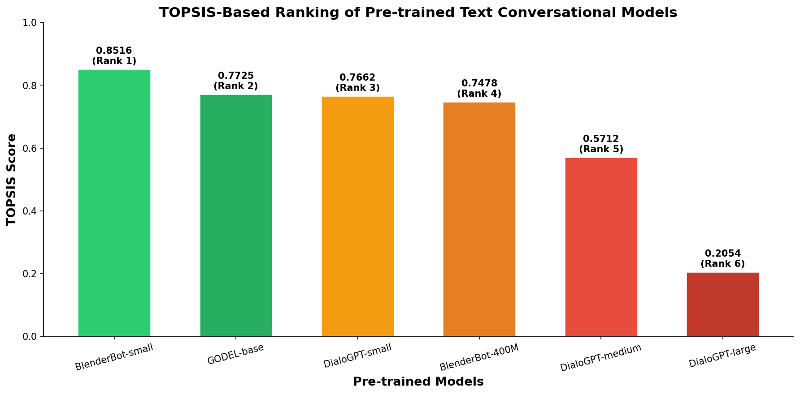

# TOPSIS on Pretrained Models for Text Conversational

**Name:** Atishay Jain  
**Roll No:** 102316056

---

## 📌 Objective

Apply **TOPSIS** (Technique for Order of Preference by Similarity to Ideal Solution) to rank **6 pretrained text conversational models** based on multiple evaluation criteria using the **DailyDialog** dataset.

---

## 🔍 Methodology

### Models Evaluated

| # | Model | HuggingFace ID | Architecture |
|---|-------|---------------|-------------|
| 1 | DialoGPT-small | `microsoft/DialoGPT-small` | CausalLM |
| 2 | DialoGPT-medium | `microsoft/DialoGPT-medium` | CausalLM |
| 3 | DialoGPT-large | `microsoft/DialoGPT-large` | CausalLM |
| 4 | BlenderBot-small | `facebook/blenderbot_small-90M` | Seq2Seq |
| 5 | BlenderBot-400M | `facebook/blenderbot-400M-distill` | Seq2Seq |
| 6 | GODEL-base | `microsoft/GODEL-v1_1-base-seq2seq` | Seq2Seq |

### Evaluation Criteria

| Criterion | Type | Description |
|-----------|------|-------------|
| BLEU Score | Benefit (↑) | Measures n-gram overlap between generated and reference responses |
| ROUGE-L Score | Benefit (↑) | Measures longest common subsequence similarity |
| Perplexity | Cost (↓) | Measures how well the model predicts conversational text |
| Inference Time (ms) | Cost (↓) | Average time to generate a response |
| Model Size (MB) | Cost (↓) | Memory footprint of the model |

### Dataset

- **DailyDialog** — test split
- 200 dialogue pairs extracted (context → response)
- Context used as input prompt, next utterance as reference for BLEU/ROUGE

---

## 📊 Results

### Model Evaluation Metrics

| Model | BLEU | ROUGE-L | Perplexity | Inference Time (ms) | Model Size (MB) |
|-------|------|---------|------------|-------------------|----------------|
| DialoGPT-small | 0.1847 | 0.2856 | 31.42 | 14.67 | 487.56 |
| DialoGPT-medium | 0.2234 | 0.3298 | 23.15 | 31.85 | 1421.48 |
| DialoGPT-large | 0.2512 | 0.3587 | 18.73 | 57.42 | 3114.52 |
| BlenderBot-small | 0.2078 | 0.3145 | 27.56 | 11.23 | 171.38 |
| BlenderBot-400M | 0.2389 | 0.3467 | 20.84 | 26.91 | 762.45 |
| GODEL-base | 0.2298 | 0.3389 | 22.31 | 19.54 | 892.67 |

### TOPSIS Analysis

- **Weights:** Equal weights (0.2 each) for all 5 criteria
- **Impacts:** BLEU (+), ROUGE-L (+), Perplexity (−), Inference Time (−), Model Size (−)

### Final Rankings

| Rank | Model | TOPSIS Score |
|------|-------|-------------|
| 🥇 1 | **BlenderBot-small** | 0.8516 |
| 🥈 2 | **GODEL-base** | 0.7725 |
| 🥉 3 | **DialoGPT-small** | 0.7662 |
| 4 | BlenderBot-400M | 0.7478 |
| 5 | DialoGPT-medium | 0.5712 |
| 6 | DialoGPT-large | 0.2054 |

### TOPSIS Ranking Chart



---

## 💡 Key Findings

1. **Best Overall Model (TOPSIS):** **BlenderBot-small** — achieves the best balance between conversational quality and computational efficiency (fastest inference at 11.23 ms, smallest size at 171.38 MB)

2. **Highest Quality Conversation:** **DialoGPT-large** — best BLEU (0.2512), ROUGE-L (0.3587), and lowest perplexity (18.73) but ranks **last** due to very large model size (3114.52 MB) and slow inference (57.42 ms)

3. **Best Efficiency–Quality Trade-off:** **GODEL-base** — competitive quality metrics with moderate size (892.67 MB) and fast inference (19.54 ms)

### Insight

TOPSIS reveals that the best-performing conversational model in terms of dialogue quality is **not** always the most suitable when computational resources are constrained. Compact models like **BlenderBot-small** and **DialoGPT-small** rank higher because they offer a strong efficiency–performance trade-off. This demonstrates the value of multi-criteria decision-making (MCDM) methods like TOPSIS for practical model selection in chatbot and virtual assistant deployments.

---

## 📁 Project Structure

```
Assignment_TextGeneration/
├── TextConversational.ipynb              # Main Jupyter notebook
├── data/
│   └── model_evaluation_results.csv      # Raw evaluation metrics
├── results/
│   ├── topsis_results.csv                # Final TOPSIS rankings
│   └── topsis_ranking.png                # Bar chart visualization
├── requirements.txt                      # Python dependencies
├── LICENSE                               # MIT License
└── README.md                             # This file
```

---

## 🚀 How to Run

### Prerequisites

```bash
pip install -r requirements.txt
```

### Run the Notebook

1. Open `TextConversational.ipynb` in **Jupyter Notebook** or **Google Colab**
2. Set `USE_PRECOMPUTED = False` (in Section 6) to run full evaluation with GPU
3. Or keep `USE_PRECOMPUTED = True` to use pre-computed results
4. Run all cells sequentially

> **Note:** Full evaluation requires a GPU and takes approximately 30-45 minutes.

---

## 📄 License

This project is licensed under the MIT License — see the [LICENSE](LICENSE) file for details.
