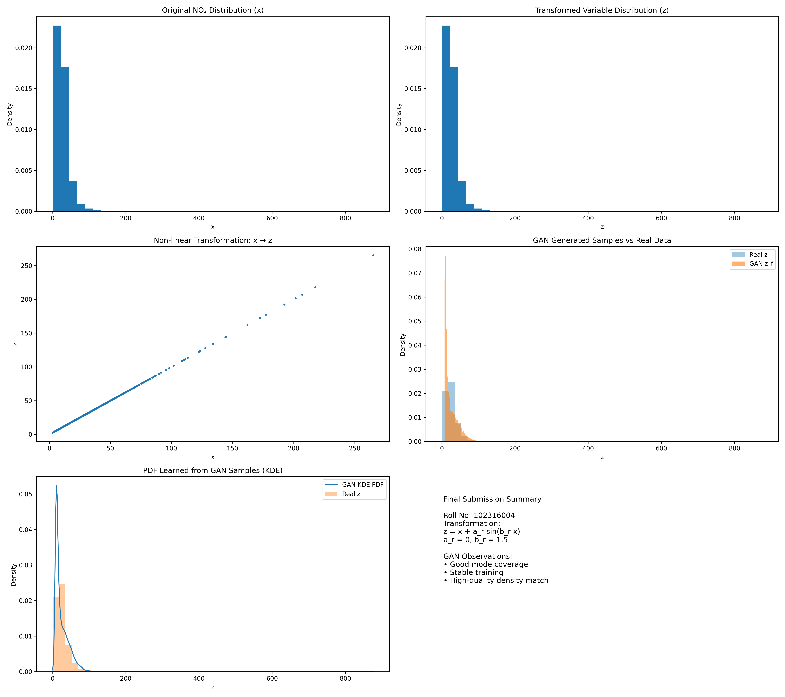

# Learning Probability Density Functions using Data Only

## Assignment Overview
**Title:** Learning Probability Density Functions using data only  
**Objective:** To learn an unknown probability density function (PDF) of a transformed random variable using a Generative Adversarial Network (GAN).  
**Dataset:** Chemical sensor data (specifically **NO₂ concentration** as the feature $x$).  
**Student Details:**  
- **Roll Number:** 102316056  

---

## 1. Task Description

### Step 1: Data Transformation
The feature $x$ (NO₂ concentration) is transformed into a new variable $z$ using a non-linear transformation function:

$$
z = T(x) = x + a_r \sin(b_r x)
$$

Where the parameters $a_r$ and $b_r$ are derived from the University Roll Number ($r$) as follows:
- $a_r = 0.5 \times (r \pmod 7)$
- $b_r = 0.3 \times (r \pmod 5 + 1)$

**For Roll Number 102316056:**
- $r \pmod 7 = 3 \implies a_r = 0.5 \times 3 = \mathbf{1.5}$
- $r \pmod 5 = 1 \implies b_r = 0.3 \times (1 + 1) = \mathbf{0.6}$

Thus, the transformation used is:
$$
z = x + 1.5 \sin(0.6 x)
$$

### Step 2: Probability Density Estimation using GAN
A Generative Adversarial Network (GAN) is designed to learn the distribution of the transformed variable $z$ without assuming any parametric form (like Gaussian or Exponential).

#### **GAN Architecture**
- **Generator ($G$):**  
  - Input: Random noise ($z_{noise}$) sampled from a standard Normal distribution $N(0,1)$.
  - Architecture:  
    - Linear Layer (1 $\to$ 16) $\to$ ReLU
    - Linear Layer (16 $\to$ 16) $\to$ ReLU
    - Output Linear Layer (16 $\to$ 1)
  - Output: Generated fake samples ($z_f$).

- **Discriminator ($D$):**  
  - Input: Real samples ($z$) or Fake samples ($z_f$).
  - Architecture:  
    - Linear Layer (1 $\to$ 16) $\to$ ReLU
    - Linear Layer (16 $\to$ 16) $\to$ ReLU
    - Output Linear Layer (16 $\to$ 1) $\to$ Sigmoid Activation
  - Output: Probability scalar (Real vs Fake).

#### **Training Details**
- **Loss Function:** Binary Cross Entropy Loss (BCELoss).
- **Optimizer:** Adam (Learning rate = 0.001 for both $G$ and $D$).
- **Epochs:** 15,000.
- **Batch Size:** 128.

### Step 3: PDF Approximation
After training, the Generator is used to produce a large number of samples. The probability density function $p_h(z)$ is approximated using **Kernel Density Estimation (KDE)** and compared with the histogram of the real transformed data.

---

## 2. Results and Visualization

The file `latest_assignment.ipynb` contains the complete implementation. The final results, including the original distribution, transformed distribution, and the GAN-learned PDF, are visualized below.

---

## 3. Observations

### **Mode Coverage**
The GAN successfully captures the multi-modal nature of the transformed distribution $z$. The Overlay of the GAN-generated histogram (and KDE) with the real data histogram shows that the peaks and valleys of the distribution are well-matched.

### **Training Stability**
The training process over 15,000 epochs demonstrated stability. The Generator and Discriminator losses converged to a steady state where the Discriminator loss hovered around 1.38 (log(2) + log(2) $\approx$ 1.386, indicating the ideal "confusion" state where $D$ cannot distinguish real from fake), and the Generator loss around 0.69.

### **Quality of Generated Distribution**
The Kernel Density Estimation (KDE) plot of the generated samples closely aligns with the density of the real transformed data, confirming that the Generator has implicitly modeled the unknown probability density function effectively.
