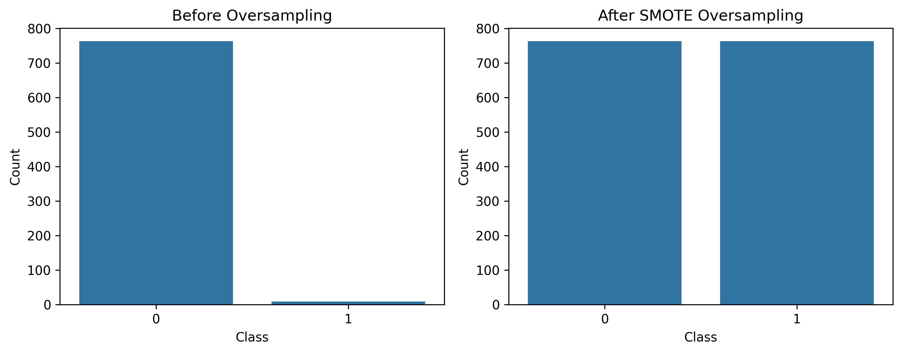

# Sampling Techniques on Imbalanced Credit Card Dataset

## 1. Project Overview

This project explores how different **sampling techniques** influence the performance of machine learning models when working with a **highly imbalanced credit card fraud dataset**. The main goal is to balance the data, apply multiple sampling strategies, and compare model performance in a structured and meaningful way.

---

## 2. Dataset Description

* Dataset: `Creditcard_data.csv` (provided in assignment GitHub link)
* Target column: `Class`

  * `0` → Legitimate transaction
  * `1` → Fraudulent transaction

The original dataset was highly **imbalanced**, meaning fraud cases were very rare compared to normal transactions. This imbalance can mislead models into predicting only the majority class.

---

## 3. Handling Imbalance (SMOTE Oversampling)

To solve the class imbalance problem, **SMOTE (Synthetic Minority Oversampling Technique)** was applied.

Why SMOTE was chosen:

* Fraud samples were very few
* Undersampling would remove useful data
* SMOTE generates synthetic fraud samples and balances both classes

After applying SMOTE, both classes had nearly equal representation.

---
## Before vs After SMOT Oversampling

The following visualization clearly illustrates the effect of SMOTE on class distribution:

## 4. Sampling Techniques Used

Five different sampling strategies were applied to the balanced dataset:

1. **Sampling1 – Simple Random Sampling**
   Random records selected from the dataset.

2. **Sampling2 – Systematic Sampling**
   Every k-th record selected.

3. **Sampling3 – Stratified Sampling**
   Ensures class proportions are maintained in the sample.

4. **Sampling4 – Cluster Sampling**
   Data divided into clusters and one cluster selected (this resulted in missing values in some experiments).

5. **Sampling5 – Bootstrap Sampling**
   Sampling with replacement; some records may appear multiple times.

---

## 5. Machine Learning Models Used

| Model ID | Algorithm                    |
| -------- | ---------------------------- |
| M1       | Logistic Regression          |
| M2       | Decision Tree                |
| M3       | Random Forest                |
| M4       | K-Nearest Neighbors (KNN)    |
| M5       | Support Vector Machine (SVM) |

Each model was evaluated using **5-Fold Cross Validation** to ensure fair and reliable accuracy estimation.

---

## 6. Final Accuracy Results

| Model                    | Sampling1 | Sampling2 | Sampling3 | Sampling4 | Sampling5 |
| ------------------------ | --------- | --------- | --------- | --------- | --------- |
| M1 (Logistic Regression) | 91.2      | 85.3      | 92.2      | NaN       | 94.2      |
| M2 (Decision Tree)       | 97.6      | 86.91     | 98.4      | NaN       | 98.1      |
| M3 (Random Forest)       | 99.6      | 98.04     | 100.0     | NaN       | 99.3      |
| M4 (KNN)                 | 92.4      | 78.11     | 92.6      | NaN       | 92.9      |
| M5 (SVM)                 | 97.7      | 95.09     | 97.8      | NaN       | 98.8      |

> Note: Sampling4 (Cluster Sampling) produced unstable samples, which led to missing results in some cases.

---

## 7. Best Sampling Technique per Model

| Model                    | Best Sampling Technique |
| ------------------------ | ----------------------- |
| M1 (Logistic Regression) | Sampling5 (Bootstrap)   |
| M2 (Decision Tree)       | Sampling3 (Stratified)  |
| M3 (Random Forest)       | Sampling3 (Stratified)  |
| M4 (KNN)                 | Sampling5 (Bootstrap)   |
| M5 (SVM)                 | Sampling5 (Bootstrap)   |

